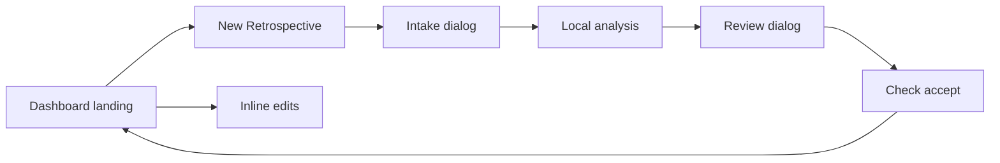

# Requirements

### Documentation Deliverable
- Create `docs/retrospective-actioncoach-plan.md` containing the approved planned changes for the retrospective flow.
- Document the dashboard-first navigation, eligible-sprint rules, `New Retrospective` intake dialog, proposal review dialog, one-click acceptance, inline action editing, owner/estimate defaults, persistence, IPC, testing, and delivery sequence.
- Keep the document aligned with this plan and treat it as planning documentation only; application source changes remain implementation work.

### Outcome
Make the Action Dashboard the landing page for the retrospective flow. Show only sprints with a successfully run retrospective, provide a prominent `New Retrospective` entry point into an intake dialog, and keep one-click proposal acceptance returning to the dashboard with model-suggested, editable defaults.

### In Scope
- Keep the Action Dashboard as the only persistent retrospective page; intake and proposal review open as modal dialogs from the dashboard rather than separate pages or persistent stage tabs.
- Replace proposal-card text actions with accessible icon buttons: checkmark to accept and `X` to dismiss, with tooltips/`aria-label`s.
- Remove the accept/edit form modal entirely. Clicking the review checkmark creates the tracked action, closes the review dialog, and returns to the dashboard after persistence succeeds.
- Have analysis return a proposed owner and estimate for every action. It may assign a named person only when supported by the transcript; otherwise it uses the retrospective uploader as the meeting-owner fallback.
- Use the existing authenticated identity (`useAuth().user.name`, falling back to `user.email`) as the uploader/meeting owner and persist it on the retrospective so re-analysis uses the same fallback.
- Make title, description, owner, and estimate directly editable on dashboard cards, with no action-edit dialog.
- Start `RetrospectivesView` on the dashboard rather than intake; the dashboard is the default landing page for the sidebar entry.
- Add a prominent `New Retrospective` button to the dashboard that clears the active retrospective and opens the intake dialog.
- Present proposal review in a modal dialog after analysis succeeds; accepting a proposal closes the review dialog and returns to the dashboard.
- Populate dashboard sprint groups and sprint filters only from retrospectives with a successful analysis run; hide sprints that have never had a retrospective run.
- Show an empty dashboard state with `New Retrospective` when no eligible sprint exists, and restrict manual-action sprint choices to eligible sprints.

### Boundaries
- If the app has no authenticated user name or email, preserve the action as `Unassigned` rather than inventing an owner.
- Preserve original AI title/description provenance and existing manual-action and mock-Jira flows.
- Do not delete actions associated with a sprint that is temporarily ineligible; omit them from this dashboard until that sprint has a qualifying retrospective run.

# Technical Design

### Current Implementation
- `src/components/retrospectives/RetrospectiveReview.tsx` renders both the redundant `View Action Dashboard →` header button and the wordy `Accept to tracking` / `Dismiss` controls; its `editingProposal` modal currently supplies blank owner plus a `1 day` default before calling `retroClient.acceptProposal`.
- `src/components/retrospectives/RetrospectivesView.tsx` owns the `intake`/`review`/`dashboard` stage transition and currently initializes `stage` to `intake` (line 24), while its dashboard branch passes every loaded sprint to `RetrospectiveDashboard` (line 122). The new flow keeps the dashboard rendered as the page and uses controlled per-stage dialog state for intake and review.
- `src/components/ui/dialog.tsx` provides the Radix `Dialog`, `DialogContent`, title, description, overlay, focus management, Escape handling, and close affordance to reuse for each modal stage.
- `src/components/retrospectives/RetrospectivesView.tsx` already resolves the authenticated uploader identity and passes it to intake; the new flow must preserve that behavior while changing the initial stage and entry callbacks.
- `RetrospectiveIntake.tsx` and `RetrospectiveReview.tsx` currently render as page content; they will receive modal-friendly sizing and controlled close/transition callbacks without taking ownership of dashboard navigation.
- `RetrospectiveDashboard.tsx` currently loads all actions and owners, derives sprint groups from the full `sprints` prop, and defaults manual-action selection to the first sprint; it has no retrospective-run eligibility input or empty dashboard entry state.
- `src/services/retro/client.ts` already exposes `listRetros()` (line 119), but `actions.list` currently accepts only one optional `sprintId` (lines 145–146), so the eligible-sprint restriction needs a typed multi-sprint/filter contract.
- `src/helpers/ipcHandlers.js` builds the local-model JSON schema with only title/description/basis, and `src/utils/retroResponseParser.ts` normalizes that same shape.
- `src/helpers/retroRepository.js` persists only proposal text, then `acceptProposal` defaults owner to empty and estimate to `0 hours`.
- `RetrospectiveDashboard.tsx` already renders owner and estimate inputs and uses `retroClient.updateAction`; action titles/descriptions are static text. `src/hooks/useAuth.ts` exposes the authenticated `user` object.

### Data and Analysis Changes
- Bump `runRetroMigrations` in `src/helpers/retroRepository.js` from the current schema version to a new ordered migration that adds `meeting_owner` to `retrospectives` and suggested owner/estimate columns to `retro_proposals`.
- Extend `Retrospective`, `RetroProposal`, creation payloads, and acceptance types in `src/services/retro/client.ts` to carry these fields.
- In `RetrospectivesView.tsx`, resolve the uploader identity as trimmed `user.name`, then `user.email`, else empty; pass it into `RetrospectiveIntake.tsx`, which sends it when creating the retrospective. Persisted meeting ownership, rather than live auth state, remains the re-analysis fallback.
- Extend the structured-output schema, repair prompt, parser interfaces, normalizer, and `rawParsedItems` in `src/helpers/ipcHandlers.js` to include `owner`, `estimateValue`, and `estimateUnit` for explicit and coach items. The prompt will instruct the local model to estimate effort, assign a transcript-supported owner where possible, and otherwise emit the supplied meeting owner; it must not invent a named participant. Normalize invalid/missing estimates to a safe default and validate units against the existing dashboard set.
- Save normalized suggestions with the proposal. `acceptProposal` uses proposal title/description plus stored owner/estimate without an `editedData` dependency, retaining the existing original-text provenance and estimate-minutes derivation.
- Load retrospectives alongside sprints and derive `eligibleSprintIds` from retrospective records whose analysis has completed successfully (for example, `analysis_run_count > 0` with a review/completed processing state). Pass only those sprint snapshots and IDs to the dashboard.
- Extend the `actions.list` payload and repository query to accept an eligible sprint-ID set, so hidden sprints are excluded at the data boundary rather than merely disappearing from presentation. Use the same set for dashboard sprint filters, accordion groups, counts, and manual-action defaults.
- Add an `onNewRetrospective` callback from `RetrospectiveDashboard` to `RetrospectivesView`; it clears the current retrospective and opens the intake dialog. After analysis, refresh the retrospective list before opening review; after acceptance, close review and return to the refreshed dashboard.

### UI and Interaction
- Initialize `RetrospectivesView` with the dashboard visible by default; load `listRetros()` with the sprint data and derive the qualifying sprint set before rendering dashboard content.
- Keep modal state separate from dashboard rendering, with a controlled `intake` or `review` dialog state and no page-level intake/review tabs.
- Replace the always-available intake navigation as the primary entry with a dashboard `New Retrospective` button. The callback resets `currentRetroId` and opens the intake dialog; the intake success path closes intake and opens review.
- Pass eligible sprints and an `onNewRetrospective` callback to `RetrospectiveDashboard.tsx`. Render only eligible sprint sections, filters, summary counts, carry-over context, and manual-action choices; render a clear empty state and the same button when the set is empty.
- Render `RetrospectiveIntake` and `RetrospectiveReview` inside separate controlled Radix `Dialog` instances using the existing dialog primitive. Add explicit `open`/`onOpenChange` or equivalent callbacks, accessible titles/descriptions, responsive scrollable content, close controls, and guarded dismissal while analysis or acceptance is in progress; only one stage dialog may be open at a time.
- Replace `onGoToDashboard` with an acceptance-success callback in `RetrospectiveReview.tsx`. On successful `acceptProposal`, close the review dialog, clear review state, refresh eligibility, and return the parent view to the dashboard.
- Remove accept-modal state, owner datalist loading used solely by it, the modal markup, and its imports. Keep the re-analysis confirmation dialog.
- Render compact `Button` controls using existing `CheckCircle`/`XCircle` icons for both proposal sections, with title/tooltip and screen-reader labels.
- Remove the review-header dashboard button and page-level intake/review tabs. Keep the completion empty-state dashboard shortcut because it is the only in-context next step once no proposals remain.
- In `RetrospectiveDashboard.tsx`, turn action title and description into controlled inline editors along with owner and estimate. Maintain draft state per card, save on blur or Enter (not every keystroke), allow Escape to discard, and refresh/update local state after a successful `actions.update` response. This keeps editing modal-free while avoiding a database IPC request for each character.

### Flow

### Compatibility
Existing retrospectives lack a meeting owner and proposal suggestions. Their accepted actions use `Unassigned` and a normalized default estimate; newly analyzed retrospectives receive model suggestions and uploader fallback. Dashboard eligibility is based on a completed analysis run, so sprints without a qualifying retrospective remain hidden without deleting their existing data.

# Testing

### Validation
- Extend `test/retro/retroResponseParser.test.js` for owner/estimate parsing, absent values, invalid units, repair-prompt schema coverage, and backward-compatible old model output.
- Extend `test/retro/retroRepository.test.js` to verify the migration, uploader persistence, suggested values copied by one-step acceptance, fallback handling for older rows, normalization, `estimate_minutes` calculation, retrospective listing, and eligible-sprint action filtering.
- Add pure utility/repository coverage for deriving eligible sprint IDs from successful retrospective records and for excluding actions from sprints without a qualifying run.
- Run `node --test "test/**/*.test.js"`.

### Manual Verification
- Confirm review has no duplicate header dashboard control, accept/dismiss are recognizable icon controls with accessible labels, and acceptance immediately changes to the dashboard.
- Confirm a transcript-named assignee is retained, an unassigned item falls back to the uploader, and all resulting action fields can be edited inline without opening an action-edit modal.
- Confirm the retrospective sidebar view opens on the dashboard, shows no sprint that lacks a completed retrospective run, and offers `New Retrospective` from both the populated and empty dashboard states.
- Confirm `New Retrospective` opens intake as a modal over the dashboard, successful analysis closes intake and opens the review modal, and accepting a proposal closes review and returns to the dashboard where the newly eligible sprint and action are visible.
- Confirm modal focus, Escape/close behavior, scroll handling, and guarded dismissal while analysis or acceptance is in progress.

# Delivery Steps

###   Step 1: Persist and generate action-assignment defaults
Retrospectives and proposals retain model-generated ownership and effort defaults for one-step acceptance.
- Add the next `PRAGMA user_version` migration and repository fields in `src/helpers/retroRepository.js` for `meeting_owner` and proposal suggestions.
- Thread authenticated uploader identity from `src/hooks/useAuth.ts` through `RetrospectivesView.tsx` and `RetrospectiveIntake.tsx` into retrospective creation.
- Extend the local-analysis prompt, structured parser, repair prompt, and proposal persistence in `src/helpers/ipcHandlers.js` and `src/utils/retroResponseParser.ts` to generate and validate owner/estimate values.
- Update `src/services/retro/client.ts` contracts and make `acceptProposal` create the action directly from normalized proposal defaults.
- Cover the extended parser and repository defaults with the existing Node tests.

###   Step 2: Make the dashboard the landing page and scope it to run retrospectives
The retrospective view opens on a dashboard containing only sprint groups with a completed retrospective analysis, with no intake or review page tabs.
- Initialize the stage in `RetrospectivesView.tsx` to `dashboard` and load `retroClient.listRetros()` alongside sprint snapshots.
- Derive qualifying sprint IDs from successful retrospective records and pass only those sprints to `RetrospectiveDashboard.tsx`.
- Extend the typed `actions.list` client, namespaced IPC dispatch, and repository query to accept a sprint-ID set so hidden sprints are excluded at the data boundary.
- Add the dashboard `New Retrospective` callback and empty state; constrain filters, accordion sections, counts, and manual-action sprint choices to eligible sprints.
- Remove persistent intake/review tab navigation from the page-level shell and prepare controlled per-stage dialog state in `RetrospectivesView`.
- Add repository/utility tests for eligible-sprint derivation and exclusion of actions from sprints without a qualifying run.

###   Step 3: Open intake and proposal review as modal stages
The primary flow is dashboard → `New Retrospective` → intake dialog → review dialog → acceptance → dashboard.
- Reset the active retrospective and open the controlled intake dialog when `New Retrospective` is clicked; avoid making intake the initial or primary landing stage.
- Add explicit controlled-dialog props/callbacks around `RetrospectiveIntake` so the parent can close it, cancel an active analysis safely, and transition to review without unmounting the dashboard page.
- Render `RetrospectiveIntake` in its own Radix dialog with an accessible title/description and responsive scroll layout.
- Refresh retrospective eligibility after analysis succeeds, close intake, and open the controlled proposal-review dialog.
- Remove the accept/edit modal and its modal-only owner loading/state from `RetrospectiveReview.tsx`; host the review component in its own controlled dialog with parent-managed close and transition callbacks.
- Replace text accept/dismiss buttons in both proposal categories with labeled checkmark and `X` icon buttons.
- Remove the redundant review-header dashboard button while retaining the completion empty-state shortcut.
- Close review after successful acceptance and return to the dashboard; preserve re-analysis through parent callbacks between the two modal stages.
- Manually verify the newly eligible sprint appears after acceptance.

###   Step 4: Make dashboard action fields fully inline-editable
Tracked actions can be revised directly on eligible dashboard cards without an edit dialog.
- Extend `RetrospectiveDashboard.tsx` and `ActionCard` with draft state and inline title/description editors, alongside the existing owner and estimate controls.
- Commit field changes on blur or Enter, discard with Escape, and use the existing `retroClient.updateAction` operation to persist only completed edits.
- Preserve status, provenance, deletion, carry-over, and Jira behaviors while refreshing action state after updates.
- Run `node --test "test/**/*.test.js"` and manually verify dashboard-first navigation, the populated and empty `New Retrospective` states, icon actions, immediate dashboard navigation, and inline editing behavior.