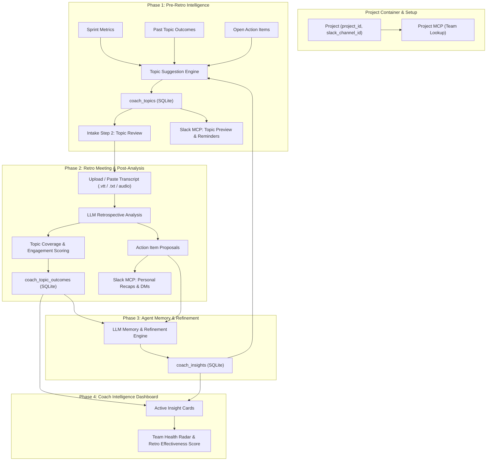

# 🧠 Agile Coach Agent — Architecture & Technical Specification

## Overview

The Agile Coach Agent extends OpenWhispr's retrospective analyst into a **persistent, learning agentic system**. Operating across sprint cycles within team **Projects**, the agent proactively suggests discussion topics before retrospectives, measures topic coverage and engagement depth from meeting transcripts, notifies team members via Slack MCP tools, and refines its coaching strategy over time using cross-sprint memory.

---

## Key Architectural Decisions

| Decision Area | Specification |
|---------------|---------------|
| **Project Container** | Top-level `projects` table (`id`, `name`, `project_id`, `slack_channel_id`). All sprints, retros, and topics belong to a Project. |
| **Team Resolution** | Project MCP looks up team members by `project_id`. Speaker names in transcripts are matched by first & last name. |
| **Slack Integration** | Electron IPC Service Bridge interfacing with Slack MCP (`send_notification` and messaging APIs). |
| **LLM Provider** | Inherits user's configured retrospective analyst model (cloud or local GGUF). Fits context dynamically. |
| **Topic Generation** | On-demand when user initiates intake for a sprint. Saved to `coach_topics` for two-phase workflow. |
| **Intake UX Flow** | `Select Sprint` → `Review Coach Topics` → `Upload/Paste Transcript` → `Analyze & Generate Action Proposals`. |
| **UI Navigation** | Top-level tabs in `RetrospectivesView`: `[ Action Items ]` `[ Coach Intelligence ]` `[ History ]` + Header Project Dropdown. |
| **Backward Compatibility** | Migration V4 auto-creates a "General Engineering" project and attaches pre-existing sprints & retros. |

---

## Architecture Diagram



---

## Database Schema (Migration V4)

```sql
-- Projects Table
CREATE TABLE IF NOT EXISTS projects (
  id TEXT PRIMARY KEY,
  name TEXT NOT NULL,
  project_id TEXT NOT NULL UNIQUE,      -- External MCP Project ID for team lookup
  slack_channel_id TEXT NOT NULL DEFAULT '', -- Target Slack Channel ID
  description TEXT DEFAULT '',
  created_at DATETIME DEFAULT CURRENT_TIMESTAMP,
  updated_at DATETIME DEFAULT CURRENT_TIMESTAMP
);

-- Add project_id FK to existing sprint_snapshots
ALTER TABLE sprint_snapshots ADD COLUMN project_id TEXT REFERENCES projects(id);

-- Add project_id FK to existing retrospectives
ALTER TABLE retrospectives ADD COLUMN project_id TEXT REFERENCES projects(id);

-- Suggested & Accepted Coaching Topics
CREATE TABLE IF NOT EXISTS coach_topics (
  id TEXT PRIMARY KEY,
  project_id TEXT NOT NULL REFERENCES projects(id) ON DELETE CASCADE,
  sprint_id TEXT NOT NULL REFERENCES sprint_snapshots(id) ON DELETE CASCADE,
  title TEXT NOT NULL,
  rationale TEXT NOT NULL DEFAULT '',
  category TEXT NOT NULL DEFAULT 'general', 
    -- 'metric_driven' | 'carryover' | 'blind_spot' | 'best_practice' | 'recurring'
  priority INTEGER NOT NULL DEFAULT 3,  -- 1 (highest) to 5 (lowest)
  state TEXT NOT NULL DEFAULT 'suggested', 
    -- 'suggested' | 'accepted' | 'dismissed' | 'discussed' | 'resolved'
  source_data TEXT DEFAULT '{}',        -- JSON: metric deltas, carried action IDs
  created_at DATETIME DEFAULT CURRENT_TIMESTAMP,
  updated_at DATETIME DEFAULT CURRENT_TIMESTAMP
);

-- Topic Outcomes & Discussion Quality Score
CREATE TABLE IF NOT EXISTS coach_topic_outcomes (
  id TEXT PRIMARY KEY,
  topic_id TEXT NOT NULL REFERENCES coach_topics(id) ON DELETE CASCADE,
  retrospective_id TEXT NOT NULL REFERENCES retrospectives(id) ON DELETE CASCADE,
  coverage_score REAL NOT NULL DEFAULT 0.0, -- 0.0 (not discussed) to 1.0 (deep dive)
  engagement_depth TEXT NOT NULL DEFAULT 'none', -- 'none' | 'surface' | 'moderate' | 'deep'
  speaker_count INTEGER NOT NULL DEFAULT 0,
  sentiment TEXT NOT NULL DEFAULT 'neutral',    -- 'positive' | 'frustrated' | 'neutral' | 'mixed'
  produced_actions INTEGER NOT NULL DEFAULT 0,
  agent_notes TEXT DEFAULT '',
  relevant_quotes TEXT DEFAULT '[]',             -- JSON array of transcript excerpts
  created_at DATETIME DEFAULT CURRENT_TIMESTAMP
);

-- Long-Term Coach Insights Across Sprints
CREATE TABLE IF NOT EXISTS coach_insights (
  id TEXT PRIMARY KEY,
  project_id TEXT NOT NULL REFERENCES projects(id) ON DELETE CASCADE,
  insight_type TEXT NOT NULL, 
    -- 'recurring_issue' | 'improving_trend' | 'blind_spot' | 'engagement_pattern' | 'correlation'
  title TEXT NOT NULL,
  description TEXT NOT NULL,
  confidence REAL NOT NULL DEFAULT 0.5,
  related_sprint_ids TEXT DEFAULT '[]', -- JSON array
  is_active INTEGER NOT NULL DEFAULT 1,
  created_at DATETIME DEFAULT CURRENT_TIMESTAMP,
  updated_at DATETIME DEFAULT CURRENT_TIMESTAMP
);

-- Audit Trail for Slack MCP Notifications
CREATE TABLE IF NOT EXISTS coach_slack_notifications (
  id TEXT PRIMARY KEY,
  project_id TEXT NOT NULL REFERENCES projects(id) ON DELETE CASCADE,
  recipient_name TEXT NOT NULL,
  recipient_slack_id TEXT DEFAULT '',
  message_type TEXT NOT NULL, 
    -- 'topic_preview' | 'owner_reminder' | 'post_retro_summary' | 'action_followup' | 'insight_share'
  message_content TEXT NOT NULL,
  sent_at DATETIME DEFAULT CURRENT_TIMESTAMP,
  status TEXT NOT NULL DEFAULT 'sent'
);
```

---

## Detailed Component Architecture

### 1. IPC & MCP Service Bridge (`src/helpers/ipcHandlers.js` & `src/services/mcpBridge.js`)
- Exposes `projects.list`, `projects.create`, `projects.update`, `projects.delete`.
- Exposes `coach.suggestTopics`, `coach.acceptTopic`, `coach.dismissTopic`.
- Exposes `coach.notifySlack` wrapping Slack MCP calls.
- Fetches project team members via Project Lookup MCP using `project_id`.

### 2. Topic Suggestion Engine (`src/services/coach/suggestionEngine.ts`)
- Ingests:
  - Active sprint metrics & velocity delta
  - Carried over open action items
  - Previous `coach_topic_outcomes` (unresolved or poorly covered topics)
  - Active `coach_insights`
- Prompts configured LLM (local or cloud) to output 3–5 structured coaching topics with rationale & category.

### 3. Intake Step 2: Topic Review (`RetrospectiveIntake.tsx`)
- After sprint selection, displays interactive topic card list.
- User can toggle accept/dismiss, edit topic title/rationale, or add custom topics.
- Accepted topics are saved to `coach_topics` table. User can proceed immediately or return later after their retro meeting.

### 4. Post-Retro Coverage Evaluation (`src/services/coach/coverageEvaluator.ts`)
- Executed during `_runRetroAnalysis` alongside action proposal extraction.
- Analyzes transcript against accepted `coach_topics`.
- Evaluates coverage score (0.0 to 1.0), engagement depth, speaker count, sentiment, and spawns `coach_topic_outcomes`.

### 5. Slack MCP Messaging Integration (`src/services/coach/slackNotifier.ts`)
- **Pre-Retro Preview**: Posts coaching agenda to configured Slack channel ID.
- **Owner Reminders**: DMs team members owning stale items (matched via team lookup MCP).
- **Post-Retro Personal Recaps**: Matches transcript speakers to Slack users and DMs individual action item summaries.
- **Mid-Sprint Follow-ups & Insight Sharing**: Posts team progress recap and coach insights to Slack channel.

### 6. Coach Intelligence Dashboard (`src/components/retrospectives/CoachDashboard.tsx`)
- **Hit Rate Metric**: % of suggested topics that reached `moderate` or `deep` coverage.
- **Retro Effectiveness Score**: Weighted composite of coverage score, action yield, and velocity recovery.
- **Engagement Trend Chart**: Visually plots discussion depth across historical retros.
- **Active Insights Cards**: Interactive cards for identified team patterns (e.g., PR review bottlenecks, testing blind spots).
- **Team Health Radar**: Spider chart showing 5 dimensions (Process Efficiency, Action Follow-through, Discussion Quality, Blocker Resolution, Topic Coverage).

---

## Implementation Roadmap (Sprints 1–4)

### Sprint 1: Data Model, Projects & Topic Engine
- DB Migration V4 (`projects`, `coach_topics`, `coach_topic_outcomes`, `coach_insights`, `coach_slack_notifications`).
- Header Project Dropdown & Project Management Modal.
- Pre-Retro Topic Suggestion Engine & IPC handlers.
- `RetrospectiveIntake.tsx` Step 2 (Coach Topic Review).

### Sprint 2: Post-Retro Coverage & Slack MCP Bridge
- Coverage Evaluator in `_runRetroAnalysis`.
- IPC Bridge to Project Lookup MCP & Slack MCP.
- Speaker name to Slack member auto-matching by first/last name.
- Pre-retro Slack preview & post-retro DM recap flows.

### Sprint 3: Memory Engine & Refinement Loop
- Cross-sprint memory prompt builder.
- Automatic pattern & insight detector (`coach_insights`).
- Dynamic escalation for recurring unresolved topics.
- Mid-sprint Slack action follow-up notifications.

### Sprint 4: Coach Intelligence Dashboard & Polish
- Dedicated `[ Coach Intelligence ]` tab in `RetrospectivesView.tsx`.
- Retrospective Effectiveness Score & Hit Rate UI.
- Team Health Radar visualization.
- End-to-end verification, error boundaries, and unit tests.
